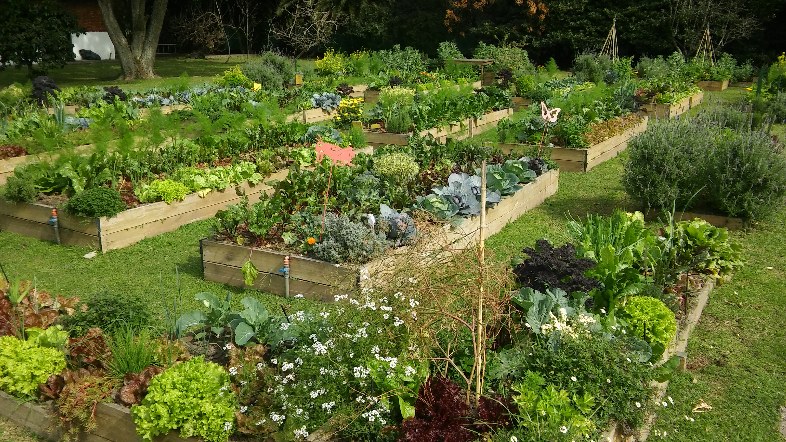

# 🌱 Semillas al viento 🌱

A raíz de la [polémica](https://www.elancasti.com.ar/opinion/2018/11/27/ley-cuestionada-389812.html) reciente sobre la posibilidad de que se modifique la [Ley de semillas y creaciones fitogenéticas, Nº 20.247](http://servicios.infoleg.gob.ar/infolegInternet/anexos/30000-34999/34822/texact.htm), una organización de pequeños productores nos pidió crear una aplicación para poder medir mejor el desempeño de sus huertas.

## 1. Plantas

Comenzaremos modelando a cada una de las plantas que hay en la huerta, de las cuales podemos configurar los siguientes aspectos:

* el **año de obtención** de la semilla. Es decir, en qué año la semilla que le dio origen se sacó de su planta "madre";
* la **altura** que tiene, medida en metros.

Además, queremos poder preguntarle:

* cuántas **horas de sol tolera**;
* si **es fuerte** o no;
* si **da nuevas semillas** o no;
* cuánto **espacio** ocupa una vez plantada, medido en metros cuadrados.

De todos ellos, el año de obtención y la altura se configuran para cada planta; el resto se calcula en función de la especie y de características generales.

Se dice que una planta **es fuerte** si tolera más de 10 horas de sol al día, esto es igual para todas las plantas. El cálculo de las **horas de sol que tolera** depende exclusivamente de cada especie (ver más abajo).

Otro aspecto que nos interesa es saber si **da nuevas semillas**, para lo cual se tiene que cumplir que la planta sea fuerte _o bien_ una condición alternativa, que define cada especie. En cuanto al **espacio que ocupa**, depende pura y exclusivamente de características de la especie.

Contemplaremos las especies que se detallan a continuación.

### Menta
Tolera seis horas de sol al día. Como condición alternativa para saber si da semillas, hay que mirar si su `altura` es mayor a 0.4 metros. Como crece al ras del suelo, diremos que el espacio que ocupa es su altura multiplicada por 3.

Ejemplos:
* una menta de 1 metro, debería dar semillas y ocupar un espacio de 3 metros cuadrados.
* una menta de solo 0.3 metros, no debería dar semillas y ocuparía 0.9 metros cuadrados de espacio.

### Soja
La tolerancia al sol depende de su altura:
* menor a 0.5 metros: 6 horas;
* entre 0.5 y 1 metro: 7 horas;
* más de 1 metro: 9 horas;

La condición alternativa para que de semillas es que su propia semilla sea de obtención reciente (posterior al 2007) y además su altura sea de más de 1 metro. El espacio que ocupa es la mitad de su altura.

Por ejemplo, si tuviesemos una soja de 0.6 metros y de semilla de 2009, la planta tendría una tolerancia al sol de 7 horas, no daría semillas y ocuparía 0.3 metros cuadrados.

### Quinoa
Existen muchas cepas de esta nutritiva planta andina y es por eso que la cantidad de horas de sol que tolera la configuraremos para cada planta. Ocupa siempre 0.5 metros cuadrados y la condición alternativa para saber si da semillas es que el año de obtención de la semilla que le dio origen sea anterior al 2005.

Por ejemplo:
* si tenemos una quinoa que tolera 12 horas de sol y su semilla de origen es de 2010, se trata de una planta que da semillas.
* si tenemos una planta que tolere 9 horas de sol pero cuya semilla de origen es de 2001, también da semillas.

## 2. Variedades

Agregar al modelo la soja transgénica y la hierbabuena, que son similares a la soja y a la menta respectivamente, pero con algunas diferencias.

La **soja transgénica** nunca da nuevas semillas, porque las empresas que las comercializan las someten adrede a un proceso de esterilización (que les asegura no perder nunca a su clientes). _Ojo_: la consulta siempre tiene que dar falso, incluso si se cumple la condición general.

La **hierbabuena** se esparce más rápido que la menta y por eso el espacio que ocupa es el doble del que ocuparía una planta de menta de las mismas características.

## 3. Parcelas

De cada parcela se conoce:
* su **ancho** y su **largo**, medidos en metros. (Para evacuar dudas: sí, van en dos atributos distintos.);
* cuántas **horas de sol** recibe por día;
* las **plantas** que tiene, representadas por una colección.

Y se pide:
* conocer la **superficie** de la parcela, que se calcula... multiplicando `ancho` por `largo`;
* saber la **cantidad máxima** de plantas que tolera, que se calcula de la siguiente manera: si el `ancho` es mayor que el `largo`, la cuenta es `superficie / 5`; si no `superficie / 3 + largo`;
* saber si **tiene complicaciones**, lo cual es así si alguna de sus plantas tolera menos sol del que recibe la parcela;
* poder **plantar una planta** que se recibe por parámetro. El efecto que produce es que se agregue a la colección. Esto debe arrojar un error si al plantar se supera la cantidad máxima _o bien_ si la parcela recibe al menos 2 horas más de sol que los que la planta tolera.

Un ejemplo:

Una parcela de 20 metros de ancho por 1 metro de largo que recibe 8 horas de sol por día, tiene una superficie de 20 metros cuadrados y la cantidad máxima de plantas que tolera es 4.

Si a esa parcela le plantamos 4 plantas de soja de más de 1 metro (que toleran 9 horas de sol), no tendría complicaciones. Si intentaramos agregar una quinta planta, se superaría la cantidad máxima y nos arrojaría un error.

## 4. Parcelas ideales

Cada planta define ciertas condiciones para saber si una parcela le resulta ideal:

* la **menta** prefiere suelos extensos, por lo cual le resultan ideales las parcelas con una superficie mayor a 6 metros cuadrados. La hierbabuena, como buena menta que es, se comporta igual;
* la **quinoa** es bajita y por eso anda mejor en parcelas en las que no haya ninguna planta cuya altura supere los 1.5 metros;
* la **soja común** va bien si la cantidad de sol que recibe la parcela es exactamente igual a los que ella tolera;
* la **soja transgénica** está pensada como monocultivo, así que prefiere parcelas cuya cantidad máxima de plantas sea igual a 1.

Agregar a las plantas la capacidad de decir si una parcela le resulta ideal.

## 5. Asociación de plantas

La asociación de plantas es una práctica ancestral que busca maximizar los beneficios de las plantas al plantarlas en conjunto con otras que de alguna manera potencian sus beneficios. Para modelar esto, debemos previamente diferenciar las parcelas en dos tipos: las ecológicas y las industriales.

Para saber si una planta **se asocia bien** dentro de una parcela, hay que tener en cuenta:
* para las **parcelas ecológicas**: que la parcela no tenga complicaciones y sea ideal para la planta;
* para las **parcelas industriales**: que haya como máximo 2 plantas y que la planta en cuestión sea fuerte.

## 6. Estadísticas del INTA

Al Instituto Nacional de Tecnología Agropecuaria (INTA), le interesa realizar una serie de estadísticas sobre todas las parcelas del país. Para ello, agregaremos al modelo un objeto único que represente al INTA, en el cual mantendremos una colección de parcelas.

Se pide realizar dos estadísticas:
* el **promedio de plantas** por parcela. Recordar para esto que un promedio se calcula como la suma (de plantas que hay en cada parcela) dividido por la cantidad (de parcelas que existen);
* obtener la parcela **más autosustentable**. Para esto, solo consideraremos aquellas parcelas con más de 4 plantas y elegiremos aquella que tenga mayor porcentaje de plantas "bien asociadas" (ver etapa 5).
